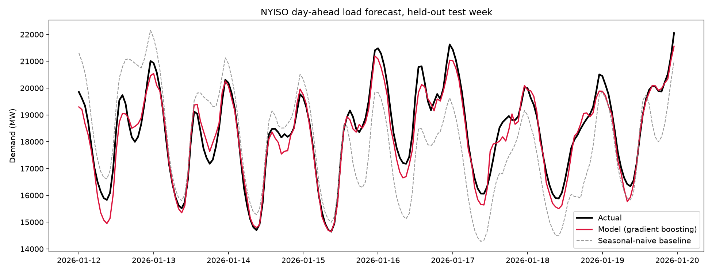
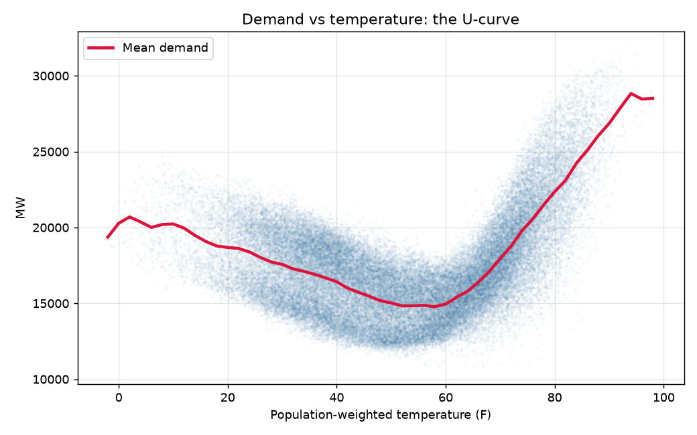
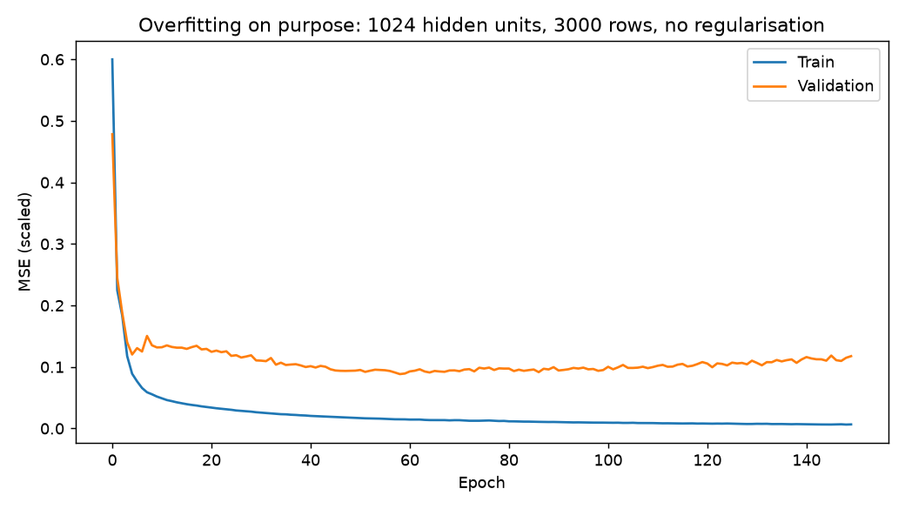

# NYISO Electricity Load Forecast

Predicts New York State's hourly electricity demand 24 hours in advance, using
public grid data and weather. Built with Python, scikit-learn, and PyTorch.



<sub>Black: actual demand. Red: the model's prediction, made 24 hours earlier.
Grey: the naive benchmark it had to beat.</sub>

**2.59% error across a full year of unseen data, 75% better than the standard
naive benchmark.** For context, real utility day-ahead forecasts typically land
in the 2 to 4% range.

| Model | Error (MW) | MAPE |
|---|---:|---:|
| **Ensemble (boosting + neural net)** | **440** | **2.59%** |
| Neural network (PyTorch) | 453 | 2.69% |
| Gradient boosting | 483 | 2.81% |
| Naive: same hour yesterday | 1,045 | 6.09% |
| Naive: same hour last week | 1,731 | 9.84% |

Scored on 8,733 held-out hours (Aug 2025 to Jul 2026). At daily peak hours, when
grid capacity is tightest, error drops from 1,183 MW to 534 MW.

## How I kept my results clean

- **Gave the models benchmarks** I used two forecasting rules and compared the models against 
  the stronger one. If the models had performed worse, I would have reported that.
- **No data from the future.** A day-ahead forecast can only use data from 24+
  hours earlier. That rule is enforced by an assertion that crashes the pipeline
  if a future edit breaks it.
- **The test set was scored once.** The set was split by date, and is never shuffled. Everything
  was made on a separate validation year.

## Backpropagation written in full

I implemented a neural network's forward and backward passes in NumPy, no
autograd, to make sure I understood how networks actually learn. Then I verified
the math two independent ways: numerical estimation and PyTorch's autograd.


Matching PyTorch to 16 decimal places means the derivation is exact.
Code: [`src/full_mlp.py`](src/full_mlp.py) · [`src/test_gradients.py`](src/test_gradients.py)

## Running it

```bash
pip install -r requirements.txt
pip install torch --index-url https://download.pytorch.org/whl/cpu
python -m src.models          # ridge + gradient boosting
python -m src.test_gradients  # verify the hand-written backprop
python -m src.train_torch     # train the neural network
```

Python 3.11+, no GPU, runs on a laptop in a few minutes. The raw data is committed,
so it reproduces offline with no API key.

## What I'd fix next

- **The model uses observed weather, not weather forecasts.** Right now, the model gets the actual weather for the day it's predicting. That's useful for evaluating the load model, but it makes the results slightly optimistic compared with how this would work in production. This is probably the biggest limitation for the current results.
- **It underpredicts daily peaks.** The model tends to underpredict the highest-demand hours, which you can see in the chart above. Part of this comes from using a loss function that favors staying close to the average rather than taking bigger risks. Quantile regression would be a good next step for handling this.
- **No uncertainty estimates.** Right now the model gives one number for each forecast with no indication of how confident it is. The forecasting system would benefit from prediction intervals so users can see the range of likely demand.

---

<details>
<summary><b>How it works: features and modelling</b></summary>

Electricity demand comes down to two things: what people are doing (work, sleep,
weekends, holidays) and how hot or cold it is (heating and air conditioning).

**Demand vs. temperature is a U, not a line.**



Demand is high when it's freezing, plateaus around 60°F, then climbs steeply
above 70°F as air conditioning kicks in. A straight line can't fit a U, so I split
temperature into two features, degrees below 65°F and degrees above 65°F. That lets
even a simple linear model bend in the right place.

**47 features total:**

- **Time:** hour, weekday, month, day of year, weekend flag, year trend
- **Cyclical encoding:** sine/cosine pairs so 11 pm and midnight are treated as
  adjacent rather than 23 apart
- **Holidays:** US and New York State, plus the day before and after
- **Weather:** heating and cooling degree days, squared terms, 24h and 72h rolling
  temperature averages (buildings hold heat, so a heatwave's fifth day differs from
  its first)
- **Four cities separately:** NYC, Buffalo, Albany, Syracuse temperatures each go in
  as their own feature, so the model learns its own weighting
- **Lags:** demand 24 to 336 hours earlier, plus rolling averages over windows
  ending 24 hours before the target

The information cutoff is enforced in code:

```python
for lag in LAGS:
    assert lag >= HORIZON_HOURS, f"lag_{lag} violates the {HORIZON_HOURS}h cutoff"
```

This is important because it's surprisingly easy to accidentally include information from too close to the prediction time and end up with a model that looks great in testing but couldn't actually be used in production.

I also keep timestamps in UTC and only convert them to local time when creating calendar features. That keeps the lag calculations consistent through daylight saving time changes.
</details>

<details>
<summary><b>The ensemble: my most interesting result</b></summary>

The gradient booster and the neural network scored almost identically on their own,
405.8 and 405.1 MW. Averaging their predictions 50/50 scored **378 MW**, better than
either alone.


This works because the two models are wrong in different places. Gradient boosting
splits the data into rectangular chunks using thresholds. A neural network fits a
smooth curved surface. They fail on different hours and in different directions, so
averaging cancels part of the error. Using two different models gives me the benefits from both models, rather than using two similar gradient-boosting models.

The blend weight was chosen using validation data only, never the test set.

</details>

<details>
<summary><b>Checking for overfitting</b></summary>

*Overfitting* is when a model starts memorizing the training data instead of learning patterns that generalize to new data. Rather than just saying my model doesn't overfit, I wanted to actually demonstrate that I know what it looks like. I deliberately built an oversized network with 1,024 hidden units, no regularization, and only 3,000 training rows, then used it as a controlled example of overfitting.




Training loss keeps dropping while validation loss bottoms out and climbs. That gap
is overfitting made visible. The model I actually use shows no such divergence
([healthy curves](reports/figures/09_learning_curve_epochs.png)) and saves the best
epoch rather than the last.

I also checked whether more data would help. Going from 40,000 to 48,599 training
rows improved error by 1 MW, which is not enough of a change for me to justify the increase. Further gains have to come from better features or better models.

</details>

<details>
<summary><b>Repo layout and data sources</b></summary>

```
src/
  config.py           paths and constants
  fetch_eia.py        EIA API download
  fetch_weather.py    Open-Meteo download
  build_dataset.py    cleaning, timezones, joining
  features.py         feature engineering
  evaluate.py         splitting, metrics, baselines
  models.py           ridge and gradient boosting
  train_torch.py      PyTorch neural network
  full_mlp.py         hand-written NumPy backprop
  test_gradients.py   gradient verification
notebooks/            exploration and diagnostics
data/raw/             committed API snapshots
reports/figures/      all charts
```

Notebooks are for exploration and charts, the logic is in the python files.

Data from the [EIA Open Data API](https://www.eia.gov/opendata/) (hourly NYISO
demand, 2019 to 2026) and the [Open-Meteo Archive](https://open-meteo.com/)
(historical weather for four New York cities). To re-download, add an EIA key to
`.env` and run `python -m src.fetch_eia` and `python -m src.fetch_weather`.

</details>

---

Built as a CS student learning deep learning, this project taught me that a good baseline matters as much as a good model. I started with two simple approaches, using the same hour yesterday and using the same hour last week. I expected the weekly baseline to be stronger, but it turned out to be worse. Testing both gave me a much more honest way to judge the models and showed me that a complicated model isn't always better than a simple one.
